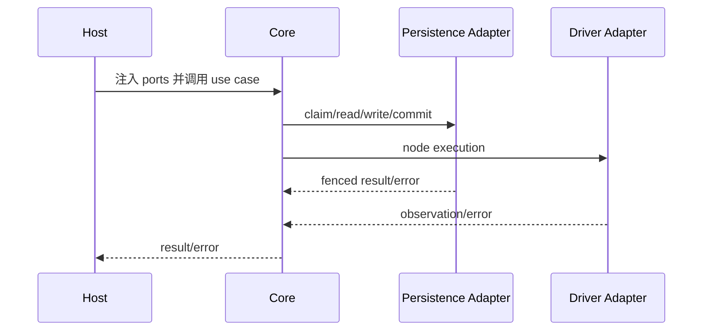
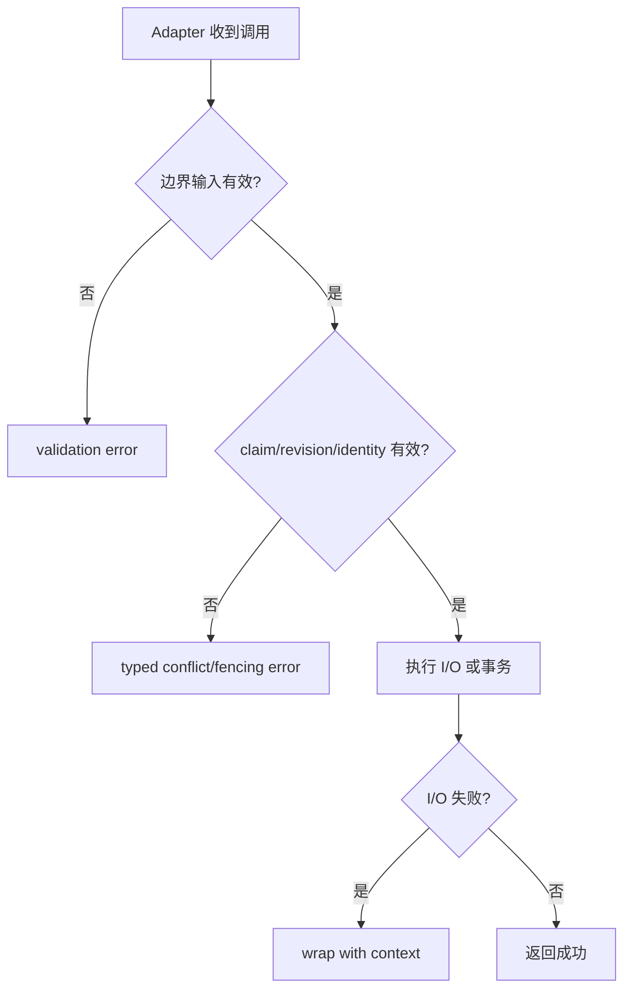

# Adapter 职责

## 入站 Adapter

- 校验并规范化外部输入，创建 RunID、ExecutionID、workerID 与时间戳。
- 组装 publication snapshots 后调用 `BuildExecutionPlan`；不得绕过 seal。
- 把 core error 映射为协议错误，同时保留冲突与校验分类。

## 调度持久化 Adapter

- `ClaimSource`：原子 claim、不可伪造 token、fenced release。
- `EntryStateReader`：返回与 sealed plan 成员完全一致的状态集合。
- `DecisionWriter`：在同一事务校验 token 并应用 transitions/next/final status。
- `RunCommands`、`QueueOrderWriter`：仅是宿主契约义务；core 没有实现命令服务或完整 queue。

## 执行 Adapter

- `CredentialAuthorizer` 在 run snapshot/授权策略下解析逻辑名；`SecretProvider` 只按授权引用取 secret，禁止日志泄漏。
- `ProgressWriter` 对非终态事件实施 worker fencing。
- `FactCommitter` 原子提交终态与 facts，检查 revision、commit identity 及 sealed dependency targets。
- Driver、Recorder、ExecutionSink 必须尊重 context；cleanup 仍可能收到 detached context。

## 组合根

## 错误与一致性

## 当前边界与延期能力

以下能力当前**不受支持或明确延期**：lease heartbeat 与过期恢复、active cancellation registry、完整队列实现、参数优先级合并、生产级 adapters 与 read projections。调用方不得从现有接口推断这些能力已经存在。

## 当前不应伪造的能力

生产 adapters/read projections 尚未提供。集成方必须明确实现或继续延期：heartbeat/lease expiry recovery、active cancellation registry、完整 queue、参数优先级，以及查询投影的一致性与重建。

## 源码证据

- [`application/scheduling/coordinator.go`](../../application/scheduling/coordinator.go)
- [`application/execution/ports.go`](../../application/execution/ports.go)
- [`application/engine/engine.go`](../../application/engine/engine.go)
