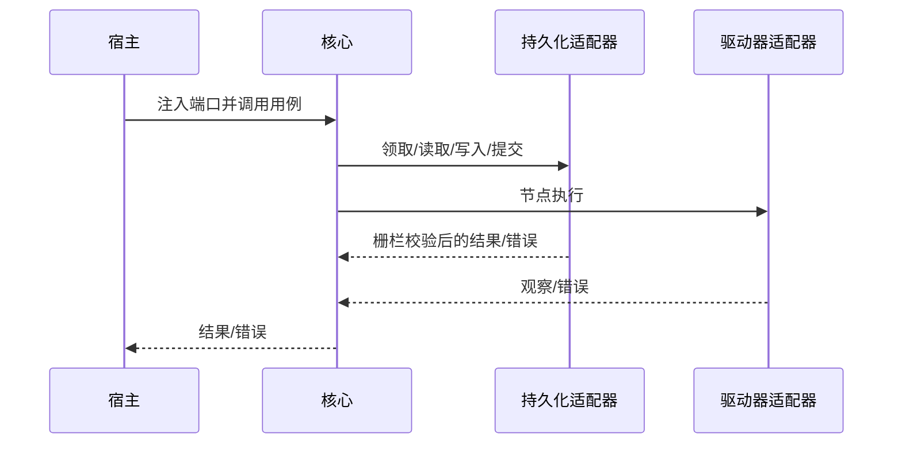
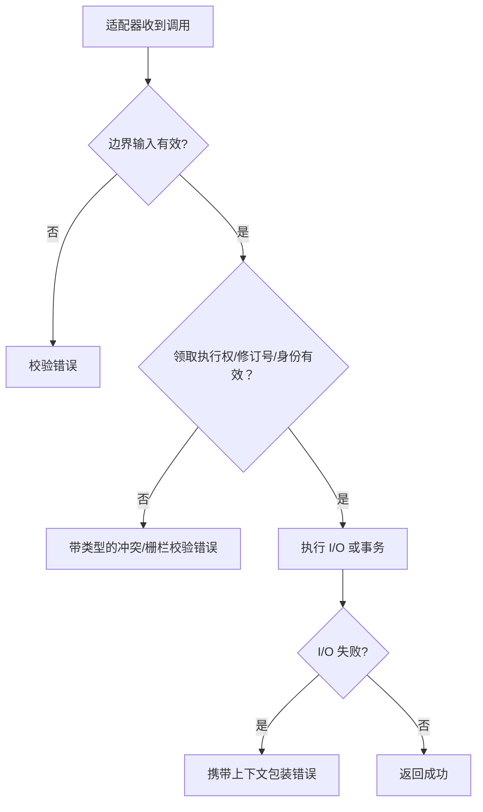

# 适配器职责

## 入站适配器

- 校验并规范化外部输入，创建 InstanceID、EntryID、工作器 ID 与时间戳。
- 组装发布快照后，通过 `CreateInstanceService.CreateInstance` 在一致目录视图中解析依赖并封存 `InstanceSnapshot`；不得绕过快照封存。
- 把 Core 错误映射为协议错误，同时保留冲突与校验分类。

## 调度持久化适配器

- `ClaimSource`：原子领取执行权、不可伪造令牌、带栅栏校验的释放。
- `EntryStateReader`：返回与 `InstanceSnapshot` 中 `execution.Plan` 成员完全一致的状态集合。
- `DecisionWriter`：在同一事务校验令牌并应用 `Decision.Transitions` 中的全部状态转换与最终状态。`Decision.NextEntryID` 只是"正在启动的那个 entry"的引用；`DecideAdvance` 产出的决策会把它对应的 Pending→Running 转换一并放进 `Transitions`，但 `Decision` 类型本身不强制这一点，适配器应以 `Transitions` 为写入依据。
- `InstanceCommandStore`：宿主必须在单个原子事务中兑现取消与中止，持久化权威状态、队列成员关系和栅栏失效；Core 的 `CancelInstanceService` 与 `AbortInstanceService` 负责编排命令、校验提交结果，并在需要时调用宿主的 `InstanceCancellationSignaler`。
- `QueueCommandStore`：宿主负责原子校验队列修订号并持久化完整顺序。

## 执行适配器

- 环境快照适配器提供所选环境的身份、修订号、基础 URL 和克隆后的类型化 `Variables`；Core 仅接收创建执行实例时冻结的副本，并在 `env.` 下只读提供，不做凭据特定解释。宿主负责安全存储这些变量、授权访问，并防止敏感值泄漏到日志。
- `ExecutionAuthorityVerifier` 在任何 Driver、Recorder、Facts 或时间线端口可见前，向领取权威验证 `InstanceID + SnapshotDigest + EntryID + ClaimToken` 仍为当前有效组合；非空 token 不得视为授权证明。
- `EntryAuthorizer` 是 `NewEntryExecutor` 的必填端口，在 `BrowserSessionFactory.Create` 阶段回答“这个工作器是否仍持有该 entry 的执行权”。它只收到 `WorkerFence` 与 `Entry`，看不到 `SnapshotDigest`，因此它不是 `ExecutionAuthorityVerifier` 的替代品；两个端口必须分别实现，并由宿主保证对同一次领取给出一致答案。
- `ProgressWriter` 对非终态事件实施工作器栅栏校验。
- `StepTransitionTransaction` 原子提交终态与事实，检查修订号、提交身份及已封存依赖目标；Core 侧的 `FactCommitter` / `StepTransitionService` 只负责校验与转交，不持久化。
- 驱动器、录制器、执行接收器必须尊重上下文；清理过程仍可能收到分离的上下文。

## 组合根

## 错误与一致性

## 当前边界与延期能力

以下能力当前**不受支持或明确延期**：租约心跳与过期恢复、活动取消注册表、完整队列实现、参数优先级合并、生产级适配器与读取投影（含查询投影的一致性与重建）。调用方不得从现有接口推断这些能力已经存在；集成方必须明确实现它们，或明确继续延期，不得伪造。

## 源码证据

- [`application/scheduling/instance_command_services.go`](../../application/scheduling/instance_command_services.go)
- [`application/scheduling/instance_command_services_test.go`](../../application/scheduling/instance_command_services_test.go)
- [`application/scheduling/instance_command_transaction_conformance_test.go`](../../application/scheduling/instance_command_transaction_conformance_test.go)
- [`application/scheduling/coordinator.go`](../../application/scheduling/coordinator.go)
- [`application/execution/ports.go`](../../application/execution/ports.go)
- [`application/engine/engine.go`](../../application/engine/engine.go)
