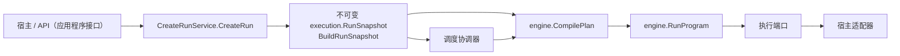

# 公共契约

## 稳定入口

公共消费者应以 Go 包导出的类型与函数为准：`application/scheduling` 的 `CreateRunService.CreateRun`、纯决策与协调器；`application/execution` 中限定于工作器作用域的执行端口和服务；`application/engine` 的编译和运行。执行实例创建服务通过 `BuildRunSnapshot` 封存 `execution.RunSnapshot`，其中包含 `execution.Plan`、环境身份/修订号/基础 URL、克隆后的普通 `automation.Properties` 及其他冻结执行输入；运行时只读地在 `env.` 下暴露这些属性，Core 不提供凭据子系统。

## 调用链

## 契约义务

- 宿主负责生成唯一 RunID/ExecutionID 并持久化发布快照。
- 领取执行权适配器负责栅栏校验、原子应用决策与安全释放。
- Core 的 `CancelRunService` 与 `AbortRunService` 实现取消/中止编排；宿主实现 `RunCommandStore`，原子持久化权威执行实例状态、队列成员关系与栅栏失效，并实现 `RunCancellationSignaler` 发送活动执行取消信号。提交后的信号失败不得回滚事务，而应由调用方按 `ErrRunSignalRetryable` 重试信号。
- `EntryExecutor` 新增必填端口 `EntryAuthorizer`：`NewEntryExecutor(authorizer, factory, runner, closeTimeout)`。授权在 `factory.Create` 之前执行，授权失败原样透传。
- `QueueCommandStore` 是宿主必须原子兑现的队列修订 CAS 与完整排列写入契约。
- 错误应通过 `errors.Is/As` 保持类别，不应依赖完整错误字符串。
- `node.Recorder.Start` 成功后返回本次执行唯一的 `RecordingTimeline`；启用 `StepTimelineSink` 时不得返回 nil。如需消费叶子步骤时间线，可实现 `StepTimelineSink`。
- `engine.CompilePlan(snapshot)` 是唯一公开编译入口；`CompiledRun` 只通过返回独立副本的 `Entries()` 与 `Entry(executionID)` 暴露结果。
- `engine.RunProgram(ctx, entry, cfg)` 是唯一公开运行入口，接收带私有 Program 与身份封印的 `CompiledEntry`，并分别返回执行、录制和时间线结果；不接受裸 `node.Program`。
- `engine.Config.RunID + SnapshotDigest + ExecutionID + ClaimToken` 必须来自已领取执行权的独立权威。入口先校验前三项与 entry 私有封印一致且 ClaimToken 非空，再通过必填的 `ExecutionAuthorityVerifier` 向领取权威验证完整四元身份；只有验证成功后 Runtime、Driver、Recorder、Facts 等运行端口才可见。身份错配返回 `ErrExecutionIdentityMismatch`，缺失 verifier 返回 `ErrExecutionAuthorityRequired`，权威拒绝或故障原样传播。
- `engine.Config` 不包含运行变量；参数由 `CompilePlan` 从不可变 `RunSnapshot` 的 invocation scopes 与 Environment 数据编译到私有 Program。
- 完成处理器只能获得 `NodeExecutionSnapshot` 和受限 `ReadOnlyBrowser`，其错误不得改变节点原始结果。如需在叶子完成后读取状态，可实现 `NodeCompletionHandler`。

## 证据

- [`contract/public_api_test.go`](../../contract/public_api_test.go)
- [`architecture/dependencies_test.go`](../../architecture/dependencies_test.go)
- [`application/scheduling/instance_command_services.go`](../../application/scheduling/instance_command_services.go)
- [`application/scheduling/instance_command_services_test.go`](../../application/scheduling/instance_command_services_test.go)
- [`application/scheduling/instance_command_transaction_conformance_test.go`](../../application/scheduling/instance_command_transaction_conformance_test.go)
- [`application/scheduling/ports.go`](../../application/scheduling/ports.go)
