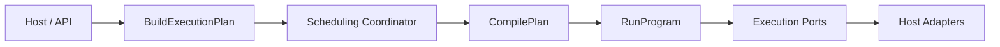

# 公共契约

## 稳定入口

公共消费者应以 Go package 导出的类型与函数为准：`application/scheduling` 的 plan 构建、纯决策与 coordinator；`application/execution` 的 worker-scoped ports/credential service；`application/engine` 的 compile/run。领域 `execution.Plan` 是运行成员、顺序、版本和 failure policy 的封印快照。

## 调用链

## 契约义务

- Host 负责生成唯一 RunID/ExecutionID 和持久化 publication snapshot。
- Claim adapter 负责 fencing、原子 decision apply 与安全 release。
- `RunCommands`、`QueueOrderWriter` 是 port-only 契约，不是 core 已实现 use case。
- 错误应通过 `errors.Is/As` 保持类别，不应依赖完整错误字符串。
- `node.Recorder.Start` 成功后返回本次运行唯一的 `RecordingTimeline`；启用 `StepTimelineSink` 时不得返回 nil。如需消费叶子步骤时间线，可实现 `StepTimelineSink`。
- `engine.RunProgramWithResult` 分别返回执行、录制和时间线 outcome；`RunProgram` 是委托该入口的 error-only 兼容入口。
- Completion Handler 只能获得 `NodeExecutionSnapshot` 和受限 `ReadOnlyBrowser`，其错误不得改变节点原始结果。如需在叶子完成后读取状态，可实现 `NodeCompletionHandler`。

## 证据

- [`contract/public_api_test.go`](../../contract/public_api_test.go)
- [`architecture/dependencies_test.go`](../../architecture/dependencies_test.go)
- [`application/scheduling/ports.go`](../../application/scheduling/ports.go)
