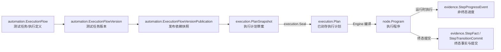

# 领域术语对照表

本文维护 Healix Core 的统一语言，帮助读者区分**业务名称、代码类型、所属领域与生命周期产物**。源码和测试仍是最终事实来源；本表不是
API 清单。

## 命名维度

- **领域（限界上下文，Bounded Context）**：概念及其不变量的归属边界，例如自动化、执行、执行证据。
- **业务术语**：讨论需求和模型时使用的正式中文名称，例如“测试任务”“执行计划”。
- **代码符号**：Go 中承载该概念的包和类型，例如 `automation.ExecutionFlow`、`execution.Plan`。
- **模型角色**：概念在领域模型中的职责，例如聚合根实体、值对象或发布快照。
- **生命周期产物**：同一业务意图经过发布、计划、编译和运行后形成的不同对象；它们不是同一个对象的别名。

## 规范译名

本表是读者文档的唯一术语权威。代码标识符和协议字面量保持原样，叙述文字统一使用下列中文名称。

| 英文术语 | 中文正式称呼 | 使用说明 |
|---|---|---|
| Bounded Context | 限界上下文 | DDD（领域驱动设计）中的模型边界。 |
| Automation | 自动化 | 领域或应用模块名称。 |
| Scheduling | 调度 | 应用编排模块。 |
| Execution | 执行 | 领域或应用模块名称。 |
| Engine | 执行引擎 | 编译和运行应用模块。 |
| Sampling | 采样 | 领域名称。 |
| Heal | 自愈 | 确定性重定位与治理概念。 |
| Evidence | 执行证据 | 可持久化的进度、观察与终态事实。 |
| Fault | 业务错误 | `domain/fault` 定义的稳定错误码契约；不是 Go 语言层面的 `error` 一词。 |
| Instance | 执行实例 | 一次完整执行的身份、快照与状态；代码统一使用 `execution.Instance`。 |
| Entry | 顶层执行项 | 执行计划中按序运行的顶层工作流执行项。 |
| Plan | 执行计划 | 已封存的执行输入与依赖快照。 |
| Program | 执行程序 | 为单次顶层执行项临时编译的节点树。 |
| Runtime | 运行时 | 单次顶层执行项的临时执行模型。 |
| claim | 领取执行权 | 工作器取得某项执行资格的原子操作。 |
| claim token | 领取令牌 | 证明当前领取执行权所有权的不可伪造值。 |
| lease | 租约 | 有时限的执行权；当前不支持心跳与过期恢复。 |
| fence / fencing | 栅栏 / 栅栏校验 | 拒绝陈旧工作器写入的并发控制。 |
| worker | 工作器 | 领取并驱动执行的宿主组件。 |
| promotion | 晋升 | 栅栏校验提交产生的自愈治理结果。 |
| revision | 修订号 | 用于 CAS（比较并交换）的不透明并发版本。 |
| seal / sealed | 封存 / 已封存 | 校验、复制并固定不可变快照。 |

## 核心术语

| 代码符号                                | 中文正式称呼       | 所属领域          | 模型角色   | 定义                                                       |
|-------------------------------------|--------------|---------------|--------|----------------------------------------------------------|
| `automation.Environment`            | 环境           | Automation    | 普通可变资产  | 保存受修订号控制的类型化 `Variables` 与基础 URL；创建执行实例时将当前状态深复制为 `execution.EnvironmentSnapshot`，而非解析 Environment 版本。Core 没有独立凭据/secret 模型。 |
| `automation.Folder`                 | 文件夹          | Automation    | 普通可变层级实体 | 受修订号控制、用于组织 Automation 资产的树形目录节点；没有不可变发布版本。 |
| `automation.ElementTarget`          | 节点资产         | Automation    | 聚合根实体  | 可编辑并可发布不可变版本供引用的节点定义资产。 |
| `automation.ElementTargetVersion`   | 节点版本         | Automation    | 版本实体   | 节点资产在特定版本上的不可变定义。                                        |
| `automation.FlowFragment`           | 工作流资产        | Automation    | 聚合根实体  | 由有序步骤和工作流引用组成的版本化自动化资产。                                  |
| `automation.FlowFragmentVersion`    | 工作流版本        | Automation    | 版本实体   | 工作流在特定版本上的定义及依赖声明。                                       |
| `automation.ExecutionFlow`          | 测试任务         | Automation    | 聚合根实体  | 面向测试业务的版本化**执行定义**；组织待执行工作流，但不是一次实际执行。             |
| `automation.ExecutionFlowVersion`   | 测试任务版本       | Automation    | 手工版本实体 | 测试任务某一版本的顶层执行项顺序、类型化参数、版本策略与失败策略；只由显式手工创作创建，Sampling/Heal 不会代为发布。 |
| `automation.ExecutionFlowItem`      | 测试任务条目       | Automation    | 子实体    | 测试任务版本中的一个有序工作流顶层执行项。                                |
| `automation.ExecutionFlowVersionPublication` | 测试任务发布计划 | Automation | 发布快照   | 发布时解析并锁定工作流、节点与工作流引用依赖的 Automation 产物。          |
| `sampling.UnpublishedFlowFragment`  | 采样工作区        | Sampling      | 草稿工作区  | 保存采样草稿与重写状态，其中的 `UnpublishedElementTarget` 尚未取得正式身份；不同于承载浏览器交互生命周期的 `sampling.Session`。 |
| `sampling.Session`                  | 采样会话         | Sampling      | 会话实体   | 管理一次浏览器采样交互、capture 幂等与关闭状态；不是采样工作区的别名。 |
| `execution.PlanSnapshot`            | 执行计划草案       | Execution     | 待验证值模型 | Scheduling 从发布物和运行输入构造的计划候选；`Seal` 之前尚不能交给执行器。            |
| `execution.Plan`                    | 执行计划         | Execution     | 已封存值快照  | `Seal` 校验、深复制并规范化后的顶层执行项与依赖计划；执行实例创建时进入不可变执行实例快照。 |
| `execution.Entry`                   | 顶层执行项       | Execution     | 计划条目   | 执行计划中按序运行的顶层工作流执行项。                                |
| `execution.WorkflowSnapshot`        | 工作流快照        | Execution     | 依赖快照   | 执行计划锁定的工作流定义。                                     |
| `execution.NodeSnapshot`            | 节点快照         | Execution     | 依赖快照   | 执行计划锁定的节点定义。                                         |
| `execution.Instance`                | 执行实例         | Execution     | 状态实体   | 一份执行的整体身份与状态；创建时解析所有 `latest` 并冻结执行实例快照。 |
| `execution.InstanceSnapshot`        | 执行实例快照         | Execution     | 已封存值快照 | 冻结测试任务、具体版本、环境类型化 `Variables`、策略和完整调用作用域；运行时不再解析 `current`/`latest`。 |
| `execution.InstanceID` / `EntryID`  | 执行实例身份 / 顶层执行项身份 | Execution | 封闭值对象 | 执行坐标是构造函数校验过的封闭类型，不是裸 `string`；由 [`TestExecutionCoordinatesAreDistinctTypesNotStrings`](../architecture/unified_language_boundary_test.go) 执行检查。 |
| `execution.InvocationScopeSnapshot` | 调用作用域快照      | Execution     | 依赖快照   | 按调用路径隔离一次顶层或嵌套工作流调用的类型化值与绑定。 |
| `parameter.Value`                   | 参数值          | Parameter     | 封闭值对象 | 保留 TEXT、NUMBER、BOOLEAN、SINGLE_SELECT、MULTI_SELECT 类型，不降级为字符串。 |
| `parameter.Binding`                 | 参数绑定         | Parameter     | 封闭值对象 | 调用边上的类型化字面量或父级引用；解析结果只进入对应调用作用域。 |
| `execution.EntryStatus`             | 顶层执行项状态     | Execution     | 状态值    | 单个顶层执行项从 `PENDING` 到终态的状态；合法迁移由 `CanTransitionTo` 单点定义。 |
| `execution.InstanceStatus`          | 执行实例状态       | Execution     | 状态值    | 整份执行实例从 `QUEUED` 到终态的状态，与顶层执行项状态是两套独立的状态机。 |
| `node.Node`                         | 可运行节点        | Node          | 行为接口   | 可由运行时执行的节点行为，不等同于 Automation 中的节点资产。                     |
| `node.Program`                      | 执行程序         | Execution     | 临时编译模型 | Engine 为一次顶层执行项执行构造的节点树与 `fingerprint.ElementTargetSpec` 索引；不持久化、不跨执行复用。 |
| `node.Runtime`                      | 运行时          | Execution     | 临时执行模型 | 驱动执行程序、浏览器、类型化参数作用域、等待、校验和修复；每个顶层执行项新建。 |
| `heal.Candidate`                    | 修复候选         | Execution / Heal | 候选值 | `domain/heal` 提供的确定性重定位候选；其运行生命周期与治理归 Execution。 |
| `heal.Decision`                     | 修复决策         | Execution / Heal | 决策值 | 根据评分、阈值和差距决定是否采用候选；算法位于 `domain/heal`，执行归属 Execution。 |
| `evidence.StepProgressEvent`        | 步骤进度事件       | Evidence      | 非终态事实  | 表示 RUNNING、HEALING、TRANSITIONING 或 VALIDATING 阶段的可持久化进度。 |
| `evidence.StepFact`                 | 步骤终态事实       | Evidence      | 终态事实   | 表示步骤成功、失败、取消或中止的最终结果。                                    |
| `evidence.HealObservation`          | 修复观察         | Evidence      | 观察事实   | 只记录修复观察，不携带晋升信息；晋升是栅栏校验提交的结果。 |
| `evidence.StepTransitionCommit`     | 步骤迁移提交       | Evidence      | 原子提交意图 | 将终态事件、最终验证与修复观察组合为一次栅栏校验提交；晋升由提交结果表达。 |
| `fingerprint.Fingerprint`           | 元素指纹         | Fingerprint   | 值对象    | 描述目标元素稳定特征，供定位匹配与修复评分使用。                                 |
| `fingerprint.Selector`              | 选择器          | Fingerprint   | 值对象    | 描述定位元素所用的选择器类型和值。                                        |
| `interpolation.Resolver` / `Expand` | 变量解析器 / 插值展开 | Interpolation | 共享语法契约 | 解析 `${name}` 变量引用并展开文本；该领域没有名为 `Template` 的类型。           |
| `fault.Error`                       | 业务错误         | Fault（共享内核） | 错误值对象  | 承载 `Kind`、稳定 `Code`、安全消息、安全参数与字段级 `Violation`；私有 cause 只经 `Unwrap` 暴露，`Format` 已封住 `%+v`/`%#v`。 |
| `fault.Kind`                        | 补救类别         | Fault（共享内核） | 封闭值对象  | 十一个补救语义之一（`INVALID_ARGUMENT`、`NOT_FOUND`、`CONFLICT` 等），回答“调用方该怎么办”。 |
| `fault.Code`                        | 业务错误码        | Fault（共享内核） | 稳定标识符  | 上下文自有的稳定标识符，前缀归所属上下文独占；只增不改、以墓碑代替删除。清单见[错误码注册表](contracts/error-code-registry.md)。 |
| `fault.Violation`                   | 字段级违规        | Fault（共享内核） | 值对象    | 用 `field` 回答“哪个输入错了”、用共享内核的 `VALIDATION_FIELD_*` 码回答“为什么错”；违规码永远不能当作顶层 `Error` 的 `Code`。 |

## 容易混淆的名称

| 名称组合                                     | 正确区分                                                                                             |
|------------------------------------------|--------------------------------------------------------------------------------------------------|
| `automation.ExecutionFlow` 与 `Execution` 领域 | 前者是 Automation 领域中承载测试任务的聚合根；后者是拥有运行计划与状态规则的领域名称。不能说测试任务在领域层“叫 Execution”。 |
| 测试任务与执行定义                                | “测试任务”是当前统一语言；“执行定义”是对其职责的抽象描述，不是代码中另一个正式类型。可表述为：**测试任务是一种面向测试业务的版本化执行定义**。                      |
| `ExecutionFlowVersionPublication` 与 `execution.Plan` | 前者是 Automation 发布时锁定资产依赖的发布快照；后者是 Scheduling 加入 `InstanceID`、顶层执行项身份和运行输入后，在 Execution 中封存的单次执行计划。       |
| `FlowFragment` 与 `Program`               | `automation.FlowFragment`（工作流资产）是可编辑、版本化和发布的自动化资产；`node.Program` 是针对一次执行编译出的执行程序。                    |
| Automation 节点资产与 Node 领域            | `automation.ElementTarget` 是可持久化的版本化资产；`node.Node` 是运行时行为接口。两者处于不同上下文。                                    |
| 执行实例与顶层执行项                      | 执行实例（`execution.Instance`）表示整份计划的运行；顶层执行项表示执行实例中某个 `execution.Entry` 的执行及其状态。两者各有独立状态机（`InstanceStatus` / `EntryStatus`）。 |
| Progress 与 Evidence                      | Progress 是 Evidence 领域接收的一类非终态事实；Evidence 是定义全部可持久化执行事实、观察和提交协议的领域。                              |
| Plan 与调度                                 | 执行计划是领域值快照；调度是构造执行计划、决定顶层执行项顺序并处理领取执行权的应用编排模块，不是领域对象。                                  |
| Environment 与 secret/credential             | Environment 是受修订号控制的普通可变 `Variables` 资产；创建执行实例时克隆当前状态为 `EnvironmentSnapshot`，不存在 Environment 发布版本，也不存在 `CredentialReference`、`CredentialService`、`SecretProvider` 或 secret store。 |
| `latest` 与具体版本                           | `latest` 只是创作策略；创建执行实例时从一致目录视图解析并冻结 `ElementTarget`、`FlowFragment`、`ExecutionFlow` 的具体发布版本，运行时不重新解析。 |
| 顶层执行项与嵌套工作流浏览器             | `EntryExecutor` 为每个顶层执行项创建并关闭一个全新的宿主所有 `BrowserSession`；该顶层执行项内的嵌套工作流共享同一会话。 |
| HealObservation 与晋升                 | 观察是事实输入；晋升是栅栏校验提交结果，不是观察字段或独立生命周期。 |
| `fault.CodeOf` 与 `fault.IsCode`         | `CodeOf`（以及 `KindOf`、`Describe`）报告边界故障的**单一**分类，用于路由与渲染；`IsCode` 走完整条链，回答某个错误码**是否参与**了这次失败。两者可能给出不同答案，不要混用。 |
| 哨兵 error 与业务错误码                   | Core 不导出任何 `Err*` 哨兵变量；分类只能通过 `fault.Code` 常量进行，由 [`TestNoExportedSentinelErrors`](../architecture/fault_contract_guard_test.go) 执行检查。 |

## 从定义到事实的生命周期

这条链路表达的是**跨上下文转换**，不是对象改名：

1. Automation 保存“要执行什么”；测试任务版本（`ExecutionFlowVersion`）由显式手工创作创建。
2. Scheduling 在创建执行实例的一致目录/事务视图中解析所有 `latest`、Environment `Variables`、类型化值与绑定以及调用作用域。
3. Execution 封存不可变 `InstanceSnapshot`；运行期间不再查询 `current`/`latest`。
4. Engine 为每个顶层执行项临时编译 `Program` 并创建 `node.Runtime`。`EntryExecutor` 调用宿主的 `BrowserSessionFactory.Create`，将一个全新的宿主所有 `BrowserSession` 交给宿主的 `EntryRunner` 连接至 Engine 执行，并在顶层执行项结束后同步关闭会话；嵌套工作流共享该 `node.Runtime` 和 `BrowserSession`，但每条调用路径拥有根据绑定派生的独立类型化参数作用域。
5. 运行时向 Evidence 提交进度、观察和终态事实；`HealObservation` 本身不执行晋升，晋升由栅栏校验提交结果表达。

完整时序参见[端到端执行](architecture/end-to-end-execution.md)，上下文归属参见[上下文地图](architecture/context-map.md)。

## 使用规则

- 讨论产品资产时使用“测试任务”；强调其技术职责时可补充“版本化执行定义”。
- “Execution”单独出现时优先指 Execution 领域；表示具体对象时使用“执行计划”“执行实例”或“顶层执行项”。
- 文档首次出现跨上下文类型时同时写代码符号与中文名，后续再使用简称。
- 新增或重命名领域概念时，应同步更新本表、对应[领域文档](domains/)和[文档导航](README.md)。
