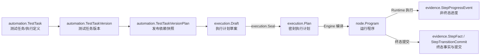

# 领域术语对照表

本文维护 Healix Core 的统一语言，帮助读者区分**业务名称、代码类型、所属领域与生命周期产物**。源码和测试仍是最终事实来源；本表不是
API 清单。

## 命名维度

- **领域（Bounded Context）**：概念及其不变量的归属边界，例如 Automation、Execution、Evidence。
- **业务术语**：讨论需求和模型时使用的正式中文名称，例如“测试任务”“执行计划”。
- **代码符号**：Go 中承载该概念的包和类型，例如 `automation.TestTask`、`execution.Plan`。
- **模型角色**：概念在领域模型中的职责，例如聚合根实体、值对象或发布快照。
- **生命周期产物**：同一业务意图经过发布、计划、编译和运行后形成的不同对象；它们不是同一个对象的别名。

## 核心术语

| 代码符号                                | 中文正式称呼       | 所属领域          | 模型角色   | 定义                                                       |
|-------------------------------------|--------------|---------------|--------|----------------------------------------------------------|
| `automation.Environment`            | 环境           | Automation    | 版本化资产  | 保存可公开环境变量及其生命周期；凭据值不属于该模型。                               |
| `automation.Folder`                 | 文件夹          | Automation    | 层级实体   | 组织 Automation 资产的树形目录节点。                                 |
| `automation.Node`                   | 节点资产         | Automation    | 聚合根实体  | 可版本化、发布和引用的节点定义资产。                                       |
| `automation.NodeVersion`            | 节点版本         | Automation    | 版本实体   | 节点资产在特定版本上的不可变定义。                                        |
| `automation.Workflow`               | 工作流资产        | Automation    | 聚合根实体  | 由有序步骤和工作流引用组成的版本化自动化资产。                                  |
| `automation.WorkflowVersion`        | 工作流版本        | Automation    | 版本实体   | 工作流在特定版本上的定义及依赖声明。                                       |
| `automation.TestTask`               | 测试任务         | Automation    | 聚合根实体  | 面向测试业务的版本化**执行定义**；组织待执行 Workflow，但不是一次实际执行。             |
| `automation.TestTaskVersion`        | 测试任务版本       | Automation    | 版本实体   | 测试任务某一版本的入口顺序、参数、版本策略与失败策略。                              |
| `automation.TestTaskItem`           | 测试任务条目       | Automation    | 子实体    | 测试任务版本中的一个有序 Workflow 入口。                                |
| `automation.TestTaskVersionPlan`    | 测试任务发布计划     | Automation    | 发布快照   | 发布时解析并锁定 Workflow、Node 与工作流引用依赖的 Automation 产物。          |
| `sampling.SamplingWorkspace`        | 采样工作区        | Sampling      | 聚合根    | 管理采样浏览、捕获、候选匹配与解析生命周期。                                   |
| `execution.Draft`                   | 执行计划草案       | Execution     | 待验证值模型 | Scheduling 从发布物和运行输入构造的计划候选；尚不能交给执行器。                    |
| `execution.Plan`                    | 执行计划         | Execution     | 密封值快照  | `Seal` 校验、深复制并规范化后的单次运行计划，包含完整且不可变的依赖闭包。                 |
| `execution.WorkflowEntry`           | 工作流执行入口      | Execution     | 计划条目   | 执行计划中按序运行的顶层 Workflow 入口。                                |
| `execution.WorkflowSnapshot`        | 工作流快照        | Execution     | 依赖快照   | 执行计划锁定的 Workflow 定义。                                     |
| `execution.NodeSnapshot`            | 节点快照         | Execution     | 依赖快照   | 执行计划锁定的 Node 定义。                                         |
| `execution.Run`                     | 运行           | Execution     | 状态实体   | 一份执行计划的整体运行身份与状态。                                        |
| `execution.ExecutionStatus`         | 入口执行状态       | Execution     | 状态值    | 单个工作流入口从待执行到终态的状态。                                       |
| `node.Node`                         | 可运行节点        | Node          | 行为接口   | 可由运行时执行的节点行为，不等同于 Automation 中的节点资产。                     |
| `node.Program`                      | 运行程序         | Node          | 编译产物   | Engine 从密封 `execution.Plan` 编译出的可运行节点程序。                 |
| `node.Runtime`                      | 节点运行时        | Node          | 领域服务   | 驱动 Program、浏览器端口、插值、等待、校验和修复流程。                          |
| `heal.Candidate`                    | 修复候选         | Heal          | 候选值    | 元素定位失败后可供评分与决策的替代目标。                                     |
| `heal.Decision`                     | 修复决策         | Heal          | 决策值    | 根据评分、阈值和差距决定是否采用候选。                                      |
| `evidence.StepProgressEvent`        | 步骤进度事件       | Evidence      | 非终态事实  | 表示 RUNNING、HEALING、TRANSITIONING 或 VALIDATING 阶段的可持久化进度。 |
| `evidence.StepFact`                 | 步骤终态事实       | Evidence      | 终态事实   | 表示步骤成功、失败、取消或中止的最终结果。                                    |
| `evidence.StepTransitionCommit`     | 步骤迁移提交       | Evidence      | 原子提交意图 | 将终态事件、最终验证、修复观察和候选重置组合为一次提交。                             |
| `fingerprint.Fingerprint`           | 元素指纹         | Fingerprint   | 值对象    | 描述目标元素稳定特征，供定位匹配与修复评分使用。                                 |
| `fingerprint.Selector`              | 选择器          | Fingerprint   | 值对象    | 描述定位元素所用的选择器类型和值。                                        |
| `interpolation.Resolver` / `Expand` | 变量解析器 / 插值展开 | Interpolation | 共享语法契约 | 解析 `${name}` 变量引用并展开文本；该领域没有名为 `Template` 的类型。           |

## 容易混淆的名称

| 名称组合                                     | 正确区分                                                                                             |
|------------------------------------------|--------------------------------------------------------------------------------------------------|
| `TestTask` 与 `Execution`                 | `TestTask` 是 Automation 领域中的业务概念；`Execution` 是拥有运行计划与状态规则的领域名称。不能说 `TestTask` 在领域层“叫 Execution”。 |
| 测试任务与执行定义                                | “测试任务”是当前统一语言；“执行定义”是对其职责的抽象描述，不是代码中另一个正式类型。可表述为：**测试任务是一种面向测试业务的版本化执行定义**。                      |
| `TestTaskVersionPlan` 与 `execution.Plan` | 前者是 Automation 发布时锁定资产依赖的发布快照；后者是 Scheduling 加入 RunID、入口执行身份和运行输入后，在 Execution 中密封的单次执行计划。       |
| `Workflow` 与 `Program`                   | Workflow 是可编辑、版本化和发布的自动化资产；Program 是针对一次执行编译出的可运行节点树。                                            |
| Automation Node 与 Node domain            | `automation.Node` 是可持久化的版本化资产；`node.Node` 是运行时行为接口。两者处于不同上下文。                                    |
| `Run` 与入口 Execution                      | Run 表示整份计划的运行；入口 Execution 表示 Run 中某个 `WorkflowEntry` 的执行及其状态。                                   |
| Progress 与 Evidence                      | Progress 是 Evidence 领域接收的一类非终态事实；Evidence 是定义全部可持久化执行事实、观察和提交协议的领域。                              |
| Plan 与调度                                 | Plan 是领域值快照；Scheduling 是构造 Plan、决定入口顺序并处理 claim 的应用编排模块，不是领域对象。                                  |

## 从定义到事实的生命周期

这条链路表达的是**跨上下文转换**，不是对象改名：

1. Automation 保存“要执行什么”，发布时冻结资产版本和依赖。
2. Scheduling 补充单次运行身份与输入，将发布物映射为 `execution.Draft`。
3. Execution 校验并密封 `Plan`，保证执行器接收完整、不可变的依赖闭包。
4. Engine 将 Plan 编译为 Node 领域的 `Program`。
5. Runtime 执行 Program，并向 Evidence 提交进度、观察和终态事实。

完整时序参见[端到端执行](architecture/end-to-end-execution.md)，上下文归属参见[上下文地图](architecture/context-map.md)。

## 使用规则

- 讨论产品资产时使用“测试任务”；强调其技术职责时可补充“版本化执行定义”。
- “Execution”单独出现时优先指 Execution 领域；表示具体对象时使用“执行计划”“运行”或“入口执行”。
- 文档首次出现跨上下文类型时同时写代码符号与中文名，后续再使用简称。
- 新增或重命名领域概念时，应同步更新本表、对应[领域文档](domains/)和[文档导航](README.md)。
